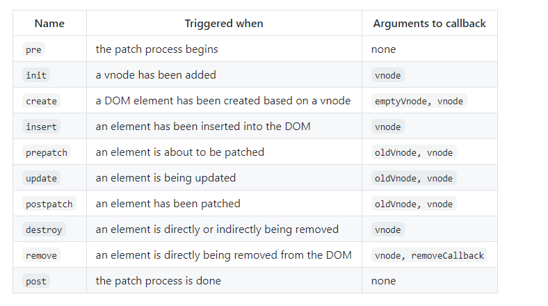

# createComponent

在前面介绍`createElement`方法的过程中，我们提到过有两处都调用了`createComponent`方法，在这一节我们来详细分析一下`createComponent`方法的实现逻辑。

`createComponent`是定义在`src/core/vmode/create-component.js`文件中的，其代码如下：

```js
export function createComponent (
  Ctor: Class<Component> | Function | Object | void,
  data: ?VNodeData,
  context: Component,
  children: ?Array<VNode>,
  tag?: string
): VNode | Array<VNode> | void {
  // ...省略其它
  const baseCtor = context.$options._base
  // plain options object: turn it into a constructor
  if (isObject(Ctor)) {
    Ctor = baseCtor.extend(Ctor)
  }

  data = data || {}

  // resolve constructor options in case global mixins are applied after
  // component constructor creation
  resolveConstructorOptions(Ctor)

  // install component management hooks onto the placeholder node
  installComponentHooks(data)

  // return a placeholder vnode
  const name = Ctor.options.name || tag
  const vnode = new VNode(
    `vue-component-${Ctor.cid}${name ? `-${name}` : ''}`,
    data, undefined, undefined, undefined, context,
    { Ctor, propsData, listeners, tag, children },
    asyncFactory
  )
  // ...省略其它
  return vnode
}
```

因为`createComponent`方法要实现的功能点有很多，以上是我们的精简代码，其中被精简掉的代码有：**组件检验相关**、**异步组件相关**、**获取prosData相关**、**抽象组件相关**以及**weex相关**。

在分析`createComponent`方法的时候，我们主要关注两个方面的内容：**构造子类构造函数**和**安装组件钩子函数**。至于最后的创建组件`VNode`并返回`VNode`，则是最简单的，在这一步我们只需要知道创建组件`VNode`的时候，向`VNode`构造函数传递的第三个参数`children`为`undefined`，也就是说组件`VNode`没有`children`子节点，因为其值为`undefined`。

代码分析：

* **构造子类构造函数**：在代码最开始，首先通过`$options._base`拿到基础构造函数，这个基础构造函数也就是大`Vue`的构造函数，`$options._base`赋值过程是在`initGlobalAPI`函数执行的过程中赋值的。

```js
export function initGlobalAPI (Vue) {
  Vue.options._base = Vue
}
```

根据我们之前介绍的规则，我们在`options`上的属性，可以在后续通过`$options`拿到，这是因为在`this._init`方法的执行过程中，进行了`mergeOptions`配置合并。

```js
vm.$options = mergeOptions(
  resolveConstructorOptions(vm.constructor),
  options || {},
  vm
)
```

我们再来看一下`createComponent`的第一个参数，以`App.vue`组件为例：

```js
import HelloWorld from '@/components/HelloWorld.vue'
export default {
  name: 'App',
  data () {
    return {
      msg: 'message',
      age: 23,
      list: [1, 2, 3]
    }
  },
  components: {
    HelloWorld
  }
}
```

我们在`App.vue`组件中`export`导出的是一个对象，其中对象定义了`name`、`data`以及`components`三个属性，那么`Ctor`参数就应该是这个对象，但当我们真实调试的时候却发现`Ctor`属性比我们想象的还要多，这是因为`vue-loader`在处理`.vue`文件的时候默认帮我们做了一些处理，以下是`App.vue`真实调试时的`Ctor`参数：

```js
const Ctor = {
  beforeCreate: [function () {}],
  beforeDestroy: [function () {}],
  components: {
    HelloWorld
  },
  data () {
    return {
      msg: 'message',
      age: 23,
      list: [1, 2, 3]
    }
  },
  name: 'App',
  render: function () {},
  staticRenderFns: [],
  __file: './App.vue',
  _compiled: true
}
```

接下来，我们来看一下`baseCtor.extend`，全局的`extend`方法的定义位置我们已经在之前介绍过了，它是在`initGlobalAPI`方法中调用`initExtend`时被定义的，其中`initExtend`定义在`src/core/global-api/extend.js`文件中，代码如下：

```js
export function initExtend (Vue: GlobalAPI) {
  Vue.cid = 0
  let cid = 1

  Vue.extend = function (extendOptions: Object): Function {
    extendOptions = extendOptions || {}
    const Super = this
    const SuperId = Super.cid
    const cachedCtors = extendOptions._Ctor || (extendOptions._Ctor = {})
    if (cachedCtors[SuperId]) {
      return cachedCtors[SuperId]
    }

    const name = extendOptions.name || Super.options.name
    if (process.env.NODE_ENV !== 'production' && name) {
      validateComponentName(name)
    }

    const Sub = function VueComponent (options) {
      this._init(options)
    }
    Sub.prototype = Object.create(Super.prototype)
    Sub.prototype.constructor = Sub
    Sub.cid = cid++
    Sub.options = mergeOptions(
      Super.options,
      extendOptions
    )
    Sub['super'] = Super

    // For props and computed properties, we define the proxy getters on
    // the Vue instances at extension time, on the extended prototype. This
    // avoids Object.defineProperty calls for each instance created.
    if (Sub.options.props) {
      initProps(Sub)
    }
    if (Sub.options.computed) {
      initComputed(Sub)
    }

    // allow further extension/mixin/plugin usage
    Sub.extend = Super.extend
    Sub.mixin = Super.mixin
    Sub.use = Super.use

    // create asset registers, so extended classes
    // can have their private assets too.
    ASSET_TYPES.forEach(function (type) {
      Sub[type] = Super[type]
    })
    // enable recursive self-lookup
    if (name) {
      Sub.options.components[name] = Sub
    }

    // keep a reference to the super options at extension time.
    // later at instantiation we can check if Super's options have
    // been updated.
    Sub.superOptions = Super.options
    Sub.extendOptions = extendOptions
    Sub.sealedOptions = extend({}, Sub.options)

    // cache constructor
    cachedCtors[SuperId] = Sub
    return Sub
  }
}
```

我们看一下`Vue.extend`方法最核心的几段代码：

```js
const Super = this
const Sub = function VueComponent (options) {
  this._init(options)
}
Sub.prototype = Object.create(Super.prototype)
Sub.prototype.constructor = Sub
```

在`extend`方法中，使用了非常经典的寄生组合继承的方式，来让`Sub`子类去继承父类的属性和方法。在原型继承之前，首先调用了`this._init`方法，这个方法的逻辑我们在之前已经提到过了，这里就不再累述。原型继承后，`Sub`子类就拥有了`Super`父类全部的属性和方法，例如：

```js
const Super = function () {
  this.id = 1
  this.name = 'Super'
}
Super.prototype.say = function () {
  console.log('hello Super')
}
const Sub = function () {
  Super.call(this)
}
Sub.prototype = Object.create(Super.prototype)
Sub.prototype.constructor = Sub

const sub = new Sub()
console.log(sub.id)   // 1
console.log(sub.name) // Super
sub.say()             // hellp Super
```

我们来看另外几段代码：

```js
const cachedCtors = extendOptions._Ctor || (extendOptions._Ctor = {})
if (cachedCtors[SuperId]) {
  return cachedCtors[SuperId]
}
cachedCtors[SuperId] = Sub
```

这几段代码是用来缓存的，作用是：如果我们先在`A.vue`文件中引入了`header.vue`组件，它会执行一遍`extend`，随后我们又在`B.vue`文件中引入了`header.vue`，由于已经有了`header.vue`组件的缓存，因此不再执行后续的代码，直接返回。

```js
// A.vue
import MHeader from '@/components/header.vue'
export default {
  name: 'AComponent',
  components: {
    MHeader
  }
}

// B.vue
import MHeader from '@/components/header.vue'
export default {
  name: 'BComponent',
  components: {
    MHeader
  }
}

// header.vue只会extend一次。
```

最后在继承完毕后，还处理了`props`、`computed`以及各种全局API方法，这部分的逻辑跟之前我们提到过的是一样的，不再此累述。

* **安装组件钩子函数**：我们在前面提到过，`Vue`中的虚拟`DOM`借鉴了开源库[snabbdom](https://github.com/snabbdom/snabbdom)的实现，在这个库里面当`VNode`节点处于不同的场景下，提供了对应的钩子函数来方便我们处理相关的逻辑，这些钩子函数如下：



在`Vue`中也用到了这些钩子函数，它的定义如下：

```js
const componentVNodeHooks = {
  init: function () {},     // 初始化时触发
  prepatch: function () {}, // patch之前触发
  insert: function () {},   // 插入到DOM时触发
  destroy: function () {}   // 节点移除之前触发
}
```

我们来看一下，`installComponentHooks`方法的定义：

```js
const hooksToMerge = Object.keys(componentVNodeHooks)
function installComponentHooks (data: VNodeData) {
  const hooks = data.hook || (data.hook = {})
  for (let i = 0; i < hooksToMerge.length; i++) {
    const key = hooksToMerge[i]
    const existing = hooks[key]
    const toMerge = componentVNodeHooks[key]
    if (existing !== toMerge && !(existing && existing._merged)) {
      hooks[key] = existing ? mergeHook(toMerge, existing) : toMerge
    }
  }
}
```

在`installComponentHooks`方法执行的时候，遍历了我们定义的`hooks`对象的属性，然后在遍历的过程中把这些`hook`赋值到我们传递的参数上面，其中有一个地方值得我们注意：如果已经有了相同的`hook`，则会执行`mergeHook`来合并，`mergeHook`方法的定义如下：

```js
function mergeHook (f1: any, f2: any): Function {
  const merged = (a, b) => {
    // flow complains about extra args which is why we use any
    f1(a, b)
    f2(a, b)
  }
  merged._merged = true
  return merged
}
```

我们以下面代码为例，来举例说明：

```js
// 合并前
const hooks = {
  init: function () {
    console.log('init hook 1')
  }
}
const vnode = {
  data: {
    hook: {
      init: function () {
        console.log('init hook 2')
      }
    }
  }
}
// 合并
mergeHook()

// 合并后
const vnode = {
  data: {
    hook: {
      init: () => {
        init1(),
        init2()
      }
    }
  }
}
```

在`createComponent`这一小节，我们介绍了组件会进行`mergeOptions`配置合并，为了更好的理解`path`的过程，我们会在接下来的小节优先介绍`mergeOptions`配置合并策略。
